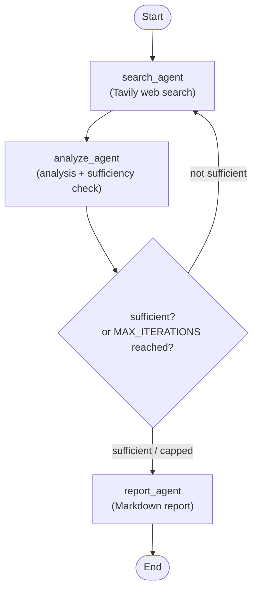

# LangGraph Research Assistant

A command-line **multi-agent research assistant** built with [LangGraph](https://github.com/langchain-ai/langgraph). Give it a research query or a factual claim, and three agents — search → analyze → report — collaboratively research it, with the analyst able to loop the searcher back for follow-up queries before writing a concise Markdown report.



- **search agent** — searches the web (Tavily) and summarizes the findings.
- **analyze agent** — produces a structured analysis and judges whether the evidence is sufficient, or requests a follow-up search.
- **report agent** — turns the analysis into a concise Markdown report.

LangGraph provides explicit state management between steps, a clear graph visualization of the workflow, and an easy path to extension (loops, parallel nodes, memory).

---

## Requirements

- Python ≥ 3.10
- An LLM provider API key (**OpenAI** by default, or Anthropic)
- A web search API key ([Tavily](https://tavily.com) by default)

---

## Installation

### 1. Clone & enter the project

```bash
git clone https://github.com/CruiseDevice/research-assistant
cd research-assistant
```

### 2. Create & activate a virtual environment

Any Python ≥ 3.10 environment works. With **conda**:

```bash
conda create -n research python=3.12
conda activate research
```

Or with **venv**:

```bash
python -m venv .venv
source .venv/bin/activate   # Windows: .venv\Scripts\activate
```

### 3. Install the package (editable, with dev extras)

```bash
pip install -e ".[dev]"
# or, much faster with uv:
uv pip install -e ".[dev]"
```

This installs all dependencies **and** registers a `research` console script. Verify:

```bash
research --help        # once the CLI is built (Phase 5)
pip show research-assistant
```

---

## Configuration

Settings are loaded from a `.env` file (gitignored) and/or the process environment. Copy the template and fill in your keys:

```bash
cp .env.example .env
```

`.env` example:

```dotenv
# --- LLM ---
LLM_PROVIDER=openai                # "openai" (default) or "anthropic"
LLM_MODEL=gpt-4o

# Provider API keys
ANTHROPIC_API_KEY=
OPENAI_API_KEY=sk-...

# --- Search ---
SEARCH_PROVIDER=tavily             # "tavily" (default)
TAVILY_API_KEY=tvly-...
```

All variables are optional at import time — missing keys are validated at the point of use (the tool / agent that needs them). Variables can be overridden inline, e.g.:

```bash
LLM_MODEL=gpt-4o-mini research "What are quantum computers?"
```

| Variable | Default | Description |
| --- | --- | --- |
| `LLM_PROVIDER` | `openai` | `openai` or `anthropic` |
| `LLM_MODEL` | `gpt-4o` | Model name for the selected provider |
| `OPENAI_API_KEY` | *(empty)* | Required when `LLM_PROVIDER=openai` |
| `ANTHROPIC_API_KEY` | *(empty)* | Required when `LLM_PROVIDER=anthropic` |
| `SEARCH_PROVIDER` | `tavily` | Search backend |
| `TAVILY_API_KEY` | *(empty)* | Required for web search |

Access settings from code:

```python
from src.config import settings
print(settings.llm_provider, settings.llm_model)
```

---

## How it works

The pipeline is a compiled LangGraph `StateGraph` exposed as the module-level `graph`. A shared `ResearchState` (keyed on `query`) flows through three nodes; the analyst can loop the searcher back for a follow-up, capped at `MAX_ITERATIONS` (=2) rounds:

1. **`search_agent`** — a ReAct agent (`create_react_agent`) with a [Tavily](https://tavily.com) search tool bound; gathers web results and summarizes the key facts, titles, and source URLs. Results are accumulated across rounds, each tagged `## Round N`.
2. **`analyze_agent`** — reads the accumulated results (treated as data inside `<search_results>` tags to limit prompt injection) and returns structured output:
   ```json
   { "analysis": "...", "sufficient": true, "follow_up_query": null }
   ```
3. **Routing** — if `sufficient` is `false` and the round count is under `MAX_ITERATIONS`, it loops back to `search_agent` with `follow_up_query`; otherwise it proceeds.
4. **`report_agent`** — turns the analysis into a concise Markdown report.

```python
from src.graph import graph

result = graph.invoke({"query": "What are quantum computers?"})
print(result["report"])
```

---

## Development

```bash
# Install with dev extras (already done above)
pip install -e ".[dev]"

# Run tests
pytest
```

The stack: **LangGraph** (workflow) · **LangChain** (LLM abstraction) · **langchain-openai** / **langchain-anthropic** (providers) · **langchain-tavily** (search) · **pydantic-settings** (config).

---

## Roadmap

Planned extensions (see `PLAN.md` Phase 7):

- [x] Feedback loop — Analyst can request the Researcher to search again (done; `MAX_ITERATIONS=2`, see `src/graph.py`)
- [ ] Parallel research — multiple Researcher nodes with different queries
- [ ] Session memory — store reports in SQLite or a vector store
- [ ] Guardrails — validate agent outputs with Pydantic schemas + retry
- [ ] Web UI — wrap `run_research()` in FastAPI or Streamlit
- [ ] DuckDuckGo fallback — zero-API-key search option

---

## Notes

- **Secrets:** `.env` is gitignored. Never commit real API keys — store them in `.env` or the environment only.
- **Search backend:** we use the standalone [`langchain-tavily`](https://pypi.org/project/langchain-tavily/) package. Do **not** install `langchain-community` or `tavily-python` separately.
- See [`AGENTS.md`](./AGENTS.md) for the step-by-step build guide.
